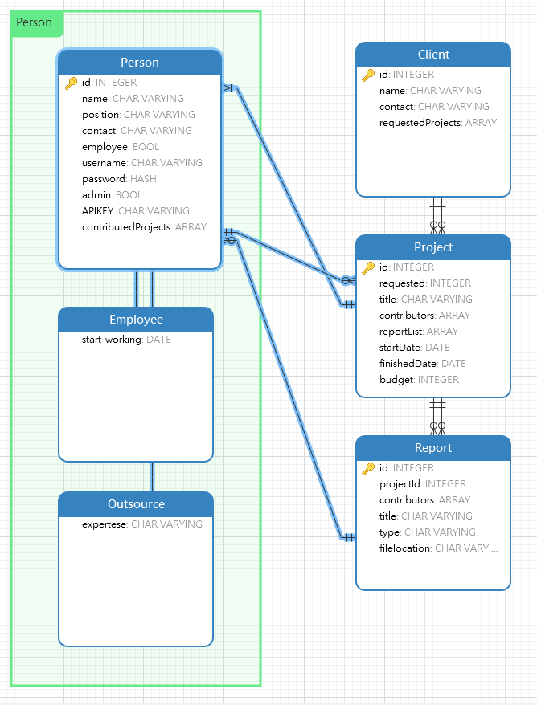

# REST API Application

## Overview

This is a project practicing of creating RESTful API application.

In order to run the project:

1. Install [Yarn](https://yarnpkg.com/)
2. Clone project
3. Create .env file in the root directory [Sample dotenv](./.envsample)
   - This project runs on [MongoDB](https://www.mongodb.com/)
4. Install dependencies:

   ```
   yarn install
   ```

5. Run server:

   ```
   yarn dev:server
   ```

## References

- [REST API Tutorial](https://www.restapitutorial.com/)
- [Nomad Coders](https://academy.nomadcoders.co/)

## ER Diagram



## Routes and Authority Planning

| URL     | Purpose                 | Authority        |
| ------- | ----------------------- | ---------------- |
| /       | Root                    | Public           |
| /signup | Signup Page             | Public           |
| /login  | Login Page              | Public           |
| /admin  | Admin Page              | Private && Admin |
| /api    | View API Key / API Root | Private          |

## API Calls

- Note: all API calls need to have **"api_key"** query

  ```
  i.e) /api/person/list?api_key=1234
  ```

| METHOD     | ADDRESS                                             | PARAMS              | BODY                                         | QUERY          | ACTION                                                            |
| ---------- | --------------------------------------------------- | ------------------- | -------------------------------------------- | -------------- | ----------------------------------------------------------------- |
| **GET**    | /api/person/list                                    |                     |                                              |                | Shows list of all Person entities                                 |
|            | /api/employee/list                                  |                     |                                              |                | Shows list of all Employee entities                               |
|            | /api/expert/list                                    |                     |                                              |                | Shows list of all Expert entities                                 |
|            | /api/project/list                                   |                     |                                              |                | Shows list of all Project entities                                |
|            | /api/project/list?client_id=:id                     |                     |                                              | client_id      | Shows list of all Project requested by Client_id                  |
|            | /api/client/list                                    |                     |                                              |                | Shows list of all Client entities                                 |
|            | /api/report/list                                    |                     |                                              |                | Shows list of all Report entities                                 |
|            | /api/report/list?project_id=:id                     |                     |                                              | project_id     | Shows list of all Report under Project_id                         |
|            | /api/person/:id                                     | id: person_id       |                                              |                | Shows detail of Person entity (This goes for Employee and Expert) |
|            | /api/project/:id                                    | id: project_id      |                                              |                | Shows detail of Project entity                                    |
|            | /api/client/:id                                     | id: client_id       |                                              |                | Shows detail of Client entity                                     |
|            | /api/report/:id                                     | id: report_id       |                                              |                | Shows detail of Report entity                                     |
| **POST**   | /api/person                                         |                     | name, position, contact, username (optional) |                | Create Person entity                                              |
|            | -                                                   |                     | w/ expertese                                 |                | Create Expert entity                                              |
|            | -                                                   |                     | w/ employee (bool)                           |                | Create Employee entity                                            |
|            | /api/project/create/:id                             | id: requestedClient | title, budget                                |                | Create Project entity requested by cleint_id                      |
|            | /api/project/:id/add_contributor?contributor_id=:id | id: project_id      |                                              | contributor_id | Add contributor to project                                        |
|            | /api/client                                         |                     | name, contact                                |                | Create Client entity                                              |
|            | /api/report/create/:id                              | id:project_id       | title, type, documentLink                    |                | Create Report entity under project_id                             |
|            | /api/report/:id/add_contributor?contributor_id=:id  | id: report_id       |                                              | contributor_id | Add contributor to report                                         |
| **PUT**    | /api/person/:id/name                                | id: person_id       | name                                         |                | Update name of Person                                             |
|            | /api/person/:id/position                            | id: person_id       | position                                     |                | Update position of Person                                         |
|            | /api/person/:id/contact                             | id: person_id       | contact                                      |                | Update contact of Person                                          |
|            | /api/person/:id/username                            | id: person_id       | username                                     |                | Update username of Person                                         |
|            | /api/person/:id/admin                               | id: person_id       |                                              |                | Toggle admin boolean of Person (Only admin can access this call)  |
|            | /api/project/:id/title                              | id: project_id      | title                                        |                | Update title of Project                                           |
|            | /api/project/:id/budget                             | id: project_id      | budget                                       |                | Update budget of Project                                          |
|            | /api/project/:id/finish                             | id: project_id      |                                              |                | Finish the project (adds finish date as Date.now                  |
|            | /api/client/:id/name                                | id: client_id       | name                                         |                | Update name of Client                                             |
|            | /api/client/:id/contact                             | id: client_id       | contact                                      |                | Update contact of Client                                          |
|            | /api/report/:id/title                               | id: report_id       | title                                        |                | Update title of Report                                            |
|            | /api/report/:id/type                                | id: report_id       | type                                         |                | Update type of Report                                             |
|            | /api/report/:id/document_link                       | id: report_id       | documentLink                                 |                | Update document link of Report                                    |
| **DELETE** | /api/person/:id                                     | id: person_id       |                                              |                | Deletes Person entity                                             |
|            | /api/project/:id                                    | id: project_id      |                                              |                | Deletes Project entity                                            |
|            | /api/project/:id/remove_contributor                 | id: project_id      |                                              | contributor_id | Deletes contributor from Project                                  |
|            | /api/client/:id                                     | id: client_id       |                                              |                | Deletes Client entity                                             |
|            | /api/report/:id                                     | id: report_id       |                                              |                | Deletes Report entity                                             |
|            | /api/report/:id/remove_contributor                  | id: report_id       |                                              | contributor_id | Deletes contributor from Report                                   |

## TODO LIST (05/22/2020~)

- [ ] Add copy API key feature
- [ ] Add admin page to control all entities
- [ ] Fix Babel regeneratorRuntime error when running build script
